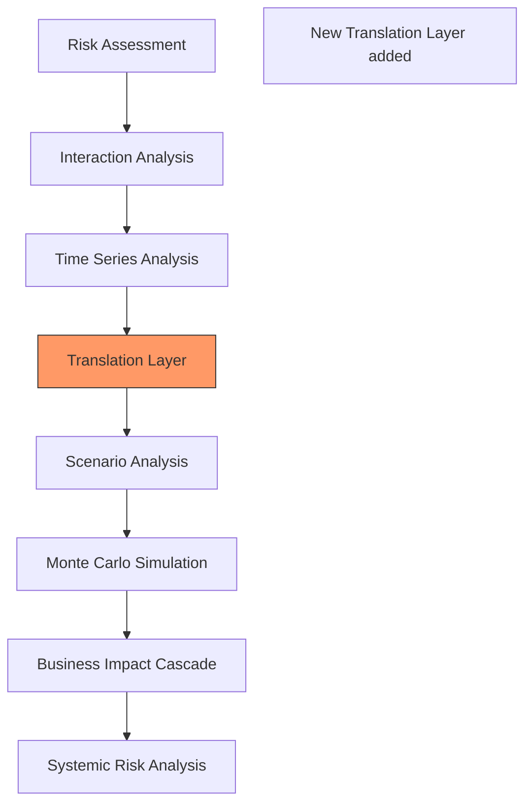

Key Points:
1. Initial abstract risk assessment (likelihood/impact)
2. Analysis of risk interactions and correlations
3. Time series projections of abstract metrics
4. NEW: Translation to business metrics
5. Scenario-based adjustments
6. Monte Carlo for uncertainty quantification
7. Business impact cascades
8. Final systemic risk evaluation