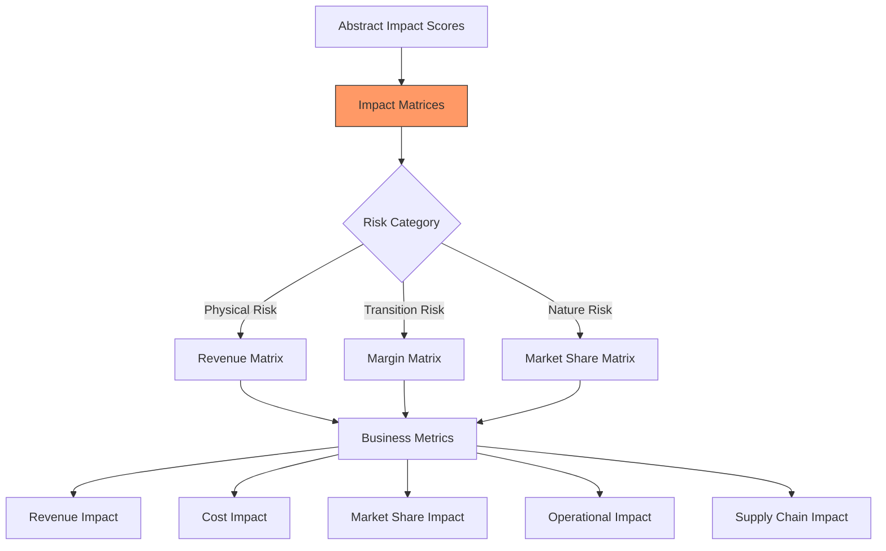

Key Points:
1. Translation happens after time series but before scenarios
2. Category-specific impact matrices
3. Multiple business metrics considered
4. Maintains traceability to risk categories
5. Allows for category-specific adjustments