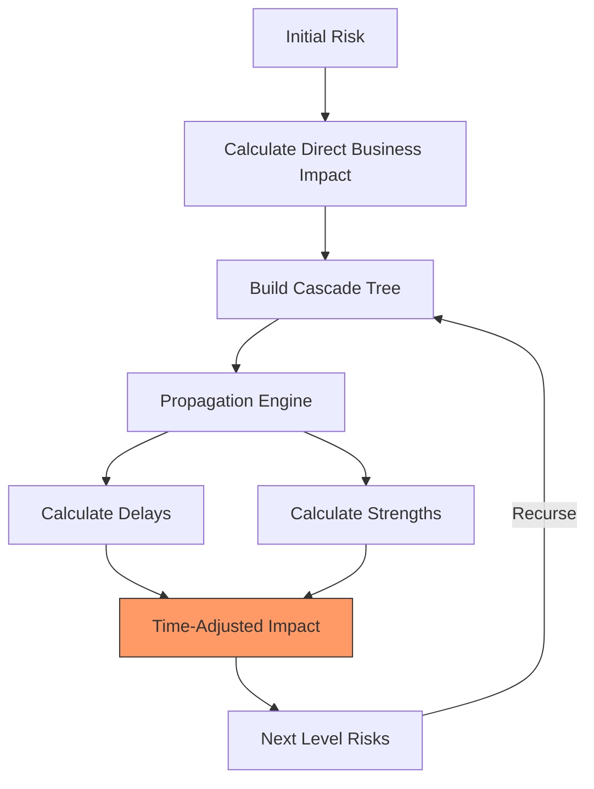

Key Points:
1. Starts with direct business impacts
2. Builds tree of cascading effects
3. Considers propagation delays
4. Calculates interaction strengths
5. Recursive propagation with depth limit
6. Time-adjusted impacts at each level