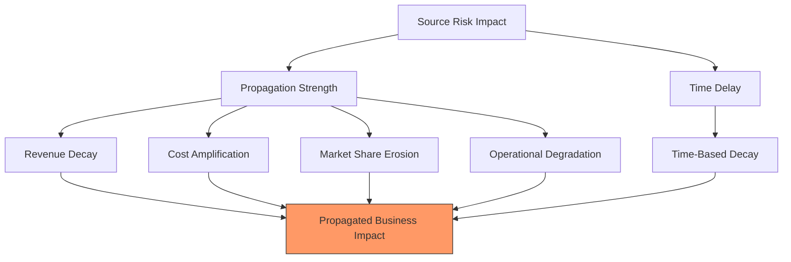

Key Points:
1. Each business metric propagates differently
2. Time delays affect propagation strength
3. Different decay rates per metric
4. Combined propagated impact
5. Maintains metric relationships