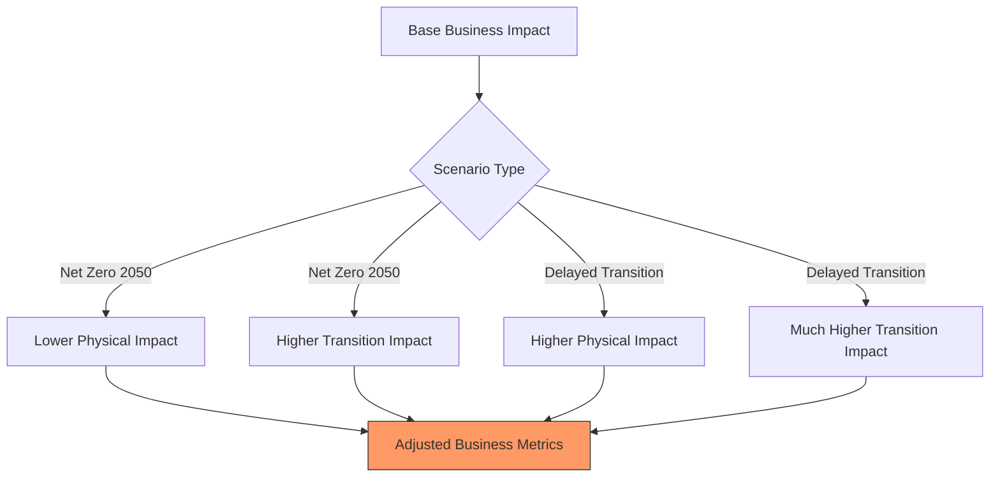

Key Points:
1. Scenario-specific adjustments to business impacts
2. Different effects by risk category
3. Maintains business metric relationships
4. Allows for non-linear adjustments
5. Scenario-specific propagation changes