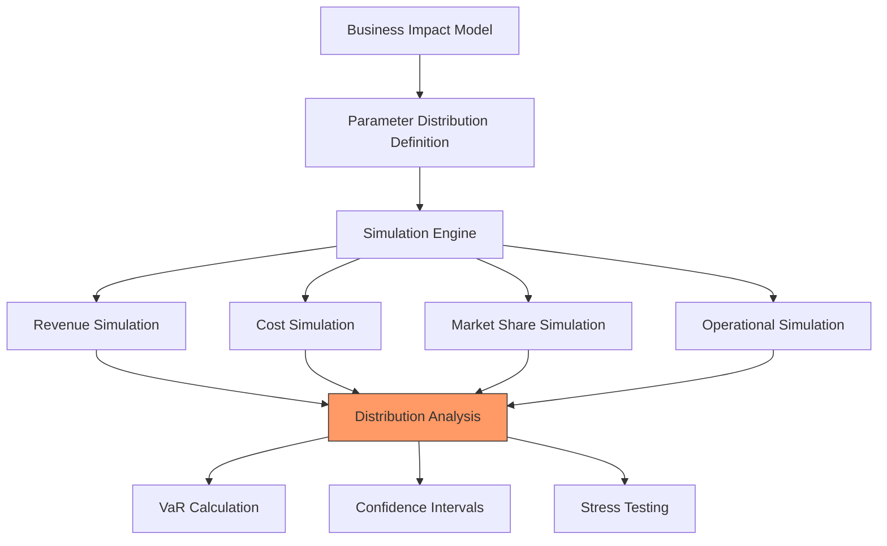

Key Points:
1. Simulates variations in business metrics
2. Uses parameter distributions from historical data
3. Runs multiple scenarios simultaneously
4. Calculates risk metrics (VaR, etc.)
5. Identifies extreme scenarios