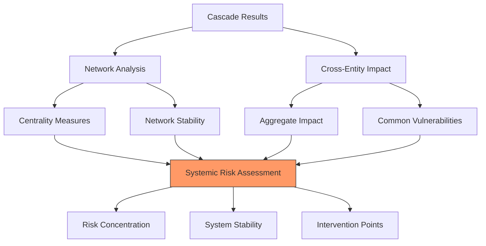

```mermaid
graph TD
    A[Cascade Results] --> B[Network Analysis]
    A --> C[Cross-Entity Impact]
    
    B --> D[Centrality Measures]
    B --> E[Network Stability]
    
    C --> F[Aggregate Impact]
    C --> G[Common Vulnerabilities]
    
    D --> H[Systemic Risk Assessment]
    E --> H
    F --> H
    G --> H
    
    H --> I[Risk Concentration]
    H --> J[System Stability]
    H --> K[Intervention Points]
    
    style H fill:#f96,stroke:#333
```

Key Points:
1. Analyzes interconnected impacts
2. Identifies systemic vulnerabilities
3. Measures network effects
4. Assesses system stability
5. Suggests intervention points